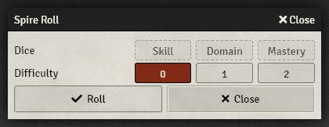
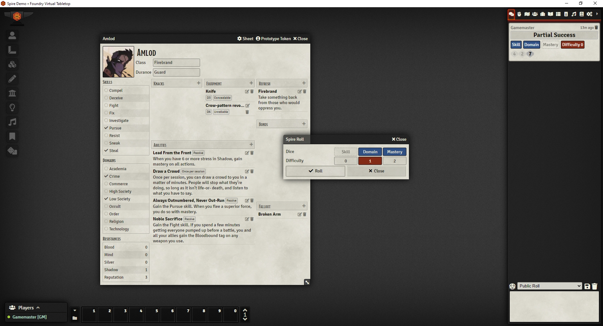

## Foundry v10 Update
This is my attempt at bringing the Spire system into compatibility with
Foundry VTT v10. I'm no wizard when it comes to Javascript so I'm basically
fumbling my way through via trial and error. I'll do my best not to break the
system in the main branch. If I can resolve the compatibility errors, I'll work on
implementing the features that the previous author had planned on.

For now there are still compatibility warnings but the current modules seem
to be backwards compatible for now until I can get them fixed.

# Foundry Virtual Tabletop Spire System

This is a package for [Foundry Virtual Tabletop](https://foundryvtt.com/)
allowing you to play the role-playing game  Spire, published by
[Rowan, Rook and Decard](https://rowanrookanddecard.com/).

The package includes a character sheet as well as an automated roll system.

## Automated Rolls

Once the package is installed, a new button appears in the scene controls:

Clicking on it will display the roll window:

## Roadmap

Right now, this package is lacking some features. I plan to include them in
future releases. Here's a detailled list:

- There are no stress trackers on the character sheet. If you want to play using
  this package, you'll have to use the alternate method proposed in the Spire
  rulebook where the game master keeps track of the characters stress on its
  own. This is the top priority on the feature list.
- There is no armor resistance value on the character sheet. This will probably
  be included in the same release as stress trackers. In the meantime you'll
  have to explicitly note which equipment and abilities are providing armor to
  your character on your character sheet.
- The automated rolls could be automated further more by reading the skills and
  domains of the selected character/token when a roll is triggered.
- Stress rolls are not implemented yet. Since they consist of a single die roll
  which type is decided by the game master, they are not a high priority. Use
  the `/roll d3` command in the meantime.
- Fallout rolls are not implemented yet. This will probably be included in the
  same release as stress trackers.

## Screenshots

## Translation

The following languages are available at the moment:

- English
- Spanish
- French
- Italian

All are based on official translations.
